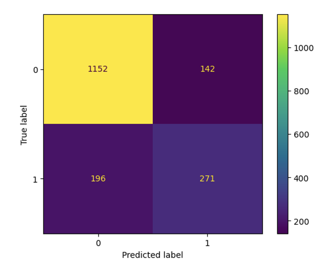

# Predicting Customer Churn using Feed-Forward Neural Networks

**Deep Learning Applications in Management Analytics**  
Krishan Gupta | 261151116

## Introduction

Customer churn is a critical issue faced by businesses across various industries. It refers to the loss of clients or customers who cease to interact with a company or business within a specific period. A high churn rate can have significant negative impacts on a company's success, both tangible and intangible. Therefore, businesses strive to retain as many customers as possible to maintain a stable revenue stream and foster long-term growth.

In this project, we explore the application of feed-forward neural networks to predict customer churn. By leveraging machine learning techniques, we aim to develop a predictive model that can identify customers who are at a high risk of churning. This proactive approach enables businesses to take targeted actions to retain these customers and minimize the impact of churn on their bottom line.

## Dataset and Preprocessing

To build our churn prediction model, we obtained a customer churn dataset from Kaggle, specifically the "Telco Customer Churn" dataset provided by IBM. This dataset contains information about customers of a telecommunications company, including their demographic details, services subscribed, and whether they churned or not.

**Data source:** [Telco Customer Churn - IBM Dataset](https://www.kaggle.com/yeanzc/telco-customer-churn-ibm-dataset)

**Shape of Dataset:** (7033, 33)

### Preprocessing Steps

The following preprocessing tasks were performed:

- **Dropped unnecessary columns:**
  - 'Churn Label', 'Churn Score', 'CLTV', and 'Churn Reason' as they were not required for model building

- **Removed univariate columns:**
  - 'CustomerID', 'Count', 'Country', 'State', and 'Lat Long' as they did not contribute to the predictive power of the model

- **Data cleaning:**
  - Handled missing values in the 'Total_Charges' column by replacing them with 0
  - Converted the 'Total_Charges' column to numeric data type
  - Performed one-hot encoding on categorical features
  - Converted all the predictors to Floats to feed to Neural Network

After preprocessing, we split the data into training and testing sets using the `train_test_split` function from scikit-learn. This allows us to evaluate the performance of our model on unseen data and assess its generalization capability.

## Model Architecture and Training

Feed-forward neural network was implemented using **PyTorch** to predict customer churn. The architecture of our baseline model consists of:
- **Input layer** (size corresponds to the number of features)
- **Two hidden layers** (100 neurons each)
- **Output layer** (produces a single value representing the probability of churn)

### Key Components

- **Activation Functions:**
  - ReLU activation function in the hidden layers
  - Sigmoid activation function in the output layer

- **Loss Function:** Binary Cross-Entropy

- **Optimizer:** Adam

- **Framework:** PyTorch Lightning (simplifies training process and provides monitoring utilities)

- **Training Duration:** 10 epochs for baseline model

## Model Evaluation

After training the baseline model, we evaluated its performance using several metrics:

- **Accuracy:** 80.01%
- **Recall:** 44%

However, accuracy alone does not provide a complete picture of the model's performance, especially in **imbalanced datasets (73% Non-churned and 27% Churned)** like ours, where the number of churned customers is relatively small compared to non-churned customers.

**We prioritized recall as our evaluation metric** because the cost of losing a customer is higher than the cost of retaining a customer. By focusing on recall, we aim to minimize the number of customers that the model predicts will not churn but actually do churn.

## Experimenting with Different Architectures

To improve the performance of our churn prediction model, we experimented with different network architectures, activation functions, and learning rates:

| Architecture | Hidden Layer Sizes | Activation Function | Learning Rate |
|-------------|-------------------|---------------------|---------------|
| **Base** | 100, 100 | ReLU | 0.01 |
| **Arch_1** | 100, 100 | ReLU | 0.011 |
| **Arch_2** | 200, 100 | Tanh | 0.0011 |
| **Arch_3** | 100, 100, 50 | LeakyReLU | 0.0051 |

### Common Parameters

- **Batch Size:** 64
- **Optimizer:** Adam
- **Loss Function:** Binary Cross Entropy
- **Epochs:** 20

### Results

| Architecture | Recall | Accuracy |
|-------------|--------|----------|
| **Base** | 44% | 80.01% |
| **Arch_1** | 41% | 79.55% |
| **Arch_2** | 42% | 78.53% |
| **Arch_3** | 58% | 80.80% |

Architecture 3 achieved the **highest recall of 58%**, while maintaining competitive accuracy at 80.80%.

### Confusion Matrix

## Conclusion

In this project, we explored the application of feed-forward neural networks for predicting customer churn. By leveraging a real-world dataset and preprocessing techniques, we developed a baseline model that achieved an accuracy of 80% and a recall of 44%.

Through experimentation with different architectures and hyperparameters, we identified an improved model (Architecture 3) that achieved a recall of 58%. This indicates that the model is capable of identifying a higher percentage of customers who are likely to churn, enabling businesses to take proactive measures to retain them.

### Future Improvements

- Continuously monitor and update the model as new data becomes available
- Incorporate additional features and data sources to enhance predictive power
- Implement ensemble methods or more advanced architectures
- Combine predictions with targeted retention campaigns

However, it is important to note that churn prediction is just one aspect of customer retention strategies. Businesses should also focus on improving customer experience, addressing customer feedback, and implementing targeted retention campaigns to minimize churn and foster long-term customer loyalty.

## Technologies Used

- **Python**
- **PyTorch**
- **PyTorch Lightning**
- **scikit-learn**
- **pandas**
- **numpy**

## References

- [Customer churn prediction using machine learning - A comprehensive overview](https://www.leewayhertz.com/ai-and-ml-in-customer-churn-prediction/)
- [How and Why to Calculate and Predict Customer Churn](https://www.pecan.ai/blog/how-why-churn-analysis-prediction/)
- [Predicting Customer Churn](https://www.avaus.com/blog/predicting-customer-churn/)
- [Amplitude - Churn Prediction](https://amplitude.com/blog/churn-prediction)

---

## License

This project is for educational purposes as part of the Deep Learning Applications in Management Analytics course.
